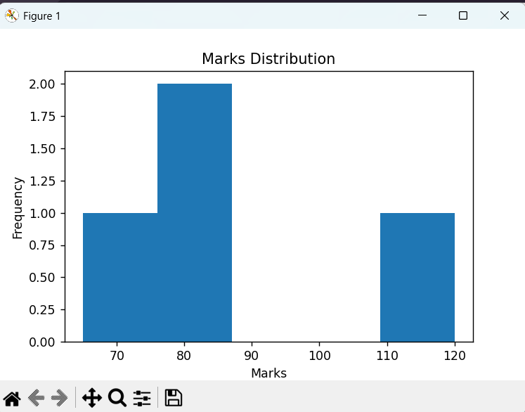

# Data Cleaning & Visualization Project

## Overview
This project demonstrates data cleaning and visualization using Python.

## Features
- Handling missing values
- Removing duplicate records
- Detecting outliers using IQR
- Data visualization using Matplotlib

## Technologies Used
- Python
- Pandas
- NumPy
- Matplotlib

## Output Screenshots

### Bar Chart


### Histogram


### Scatter Plot


### Pie Chart


## How to Run

```bash
pip install pandas numpy matplotlib
python data_cleaning_visualization.py
```

## Author
Agalya Manikandan
